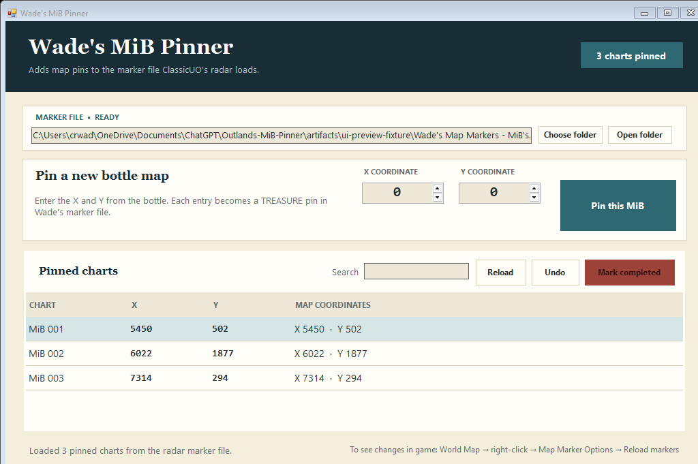

# Wade's MiB Pinner

A tiny, portable Windows app for adding message-in-a-bottle coordinates to the Ultima Online Outlands ClassicUO World Map—and removing each marker when the chart is completed.

It has no installer, no account, no server, and no runtime to download. The release is a single Windows `.exe` built against the .NET Framework already included with Windows 10 and 11.



## Download and use it

1. Open the [latest release](https://github.com/ChrisRWade/Outlands-MiB-Pinner/releases/latest) and download `Wades-MiB-Pinner.exe` (or the ZIP).
2. Double-click it, enter the bottle's **X** and **Y**, and choose **Pin this MiB**.
3. In ClassicUO, open the World Map, right-click it, choose **Map Marker Options**, then reload markers.

Select one or more charts and choose **Mark completed** to remove their markers. **Undo** restores the most recent backup.

## How it works

ClassicUO's radar system loads map pins from XML marker files in its `Data\Client` folder. Every coordinate added in Wade's MiB Pinner becomes a `TREASURE` map pin in `Wade's Map Markers - MiB's.xml`. Completing or undoing a chart updates that same file.

ClassicUO does not automatically notice those file changes. After adding, removing, or restoring a marker, open the World Map, right-click it, choose **Map Marker Options**, and select **Reload markers** before the change will appear in game.

> Windows may show a SmartScreen warning because this free utility is not code-signed. If you downloaded it from this repository, compare its SHA-256 value with `SHA256SUMS.txt` in the release before running it.

## What it changes

The app only creates or edits this file inside the selected ClassicUO `Data\Client` folder:

```text
Wade's Map Markers - MiB's.xml
```

The default folder is:

```text
C:\Program Files (x86)\Ultima Online Outlands\ClassicUO\Data\Client
```

That folder is normally protected by Windows. The app detects this and offers **Restart as administrator**. If Outlands is installed elsewhere, choose its `ClassicUO\Data\Client` folder from the app.

Every update is written to a temporary file, validated as XML, and then installed in one operation. When the file already exists, its prior contents are kept as:

```text
Wade's Map Markers - MiB's.xml.backup
```

The app also detects if another program changes the marker file while it is open, preventing an accidental overwrite. Existing comments, text, unknown attributes, and unknown XML elements are preserved.

## Marker format

New markers use ClassicUO's installed `TREASURE` map icon and Outlands facet `0`:

```xml
<?xml version="1.0" encoding="utf-8"?>
<Pack Name="Wade's Map Markers - MiB's" Revision="0">
  <Marker Name="MiB 001" X="5450" Y="502" Icon="TREASURE" Facet="0" />
</Pack>
```

Duplicate X/Y coordinates are blocked and the existing row is selected instead.

## Build from source

No SDK or package restore is required. On Windows 10 or 11 with .NET Framework 4.8:

```powershell
.\scripts\test.ps1
.\scripts\build.ps1
```

Release files are written to `artifacts\`. The GitHub Actions workflow runs the same tests and creates downloadable release assets whenever a `v*` tag is pushed.

## License

[MIT](LICENSE)
